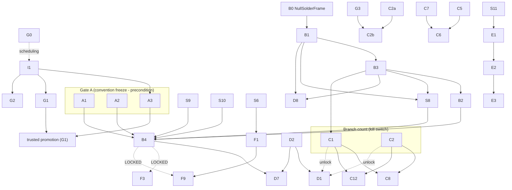

# Null-edge job dependency DAG

**No-build strategy/audit deliverable. Generated 2026-06-26 (job G0).**

This report builds the dependency graph for the null-edge / null-strand unified
mass program: the returned jobs (`R1`–`R4`), the submitted-and-awaiting jobs
(`S1`–`S16`), and the backlog gates `A`/`B`/`C`/`D`/`E`/`F`, plus the QCD (`Q`),
source (`L`), manuscript (`M`), integration (`I`), and integration-control (`G`)
families. It records both **theorem dependencies** (one job's Lean output is an
input to another's) and **assumption dependencies** (one job freezes a
convention, sign, frame, or claim label that another must import).

No Lean, Lake, or build command was run. Status labels are read from the
program's own source documents
(`AgentTasks/null-edge-aristotle-ambitious-job-backlog-2026-06-26.md`,
`AgentTasks/null-edge-unified-mass-proof-chain.md`, and
`Sources/Null_Edge_Unified_Mass_Model_Working_Plan.md` Sections 20–21) and must
be re-verified against the live repo before any promotion.

Sources used:

- Job universe + statuses: the ambitious job backlog (`R`/`S`/`A`–`G`/`Q`/`L`/`M`/`I`).
- Theorem-to-theorem chain `T1`–`T18`: the unified-mass proof chain.
- Gate structure, kill switches, ordering, and the integration freeze: Working
  Plan §20 (gates A–F, canonical-obstruction datum) and §21 (integrate before
  expanding, Gate A as promotion gate, `B1 -> B3 -> B2 -> B4`, Gate C kill
  switch, `S11 -> E1 -> E2 -> E3`, prediction lockout).

---

## 0. Conventions for reading this DAG

- `X -> Y` means **Y depends on X**: X must land (and be integrated) before Y is
  trustworthy. Y is a *dependent* of X; X is a *prerequisite* of Y.
- **Gate** column: the precondition node(s) that must clear before the job may be
  *promoted to a trusted surface* (not merely run experimentally).
- Two special node classes act as **kill-switch / precondition nodes** (per the
  PROMPT guardrails):
  - **Gate A** (`A1`, `A2`, `A3`): convention/sign/grading freeze. Nothing in the
    finite-square or super-Dirac line may be *promoted* until Gate A clears.
  - **Branch-count** (`C1`, `C2` = `C2a`+`C2b`): the determinant-level branch
    audit. If it shows unavoidable physical doublers or growing complex modes,
    it *kills* the heavy continuum (`D`) and chirality (`C8`–`C12`) lines and
    forces a downgrade.
- **Prediction lockout** (PROMPT guardrail): no prediction job (`F`-family,
  `T17`) is "available" until both the **finite operator** (`B4` finite-square /
  `T14` graded super-Dirac square) **and** the **moduli data** (`S6` ledger /
  `F1` ranking) exist. These edges are marked `[LOCKED]`.

---

## 1. Master dependency table

Legend for Type: P=Proof, Au=Audit, St=Strategy, Src=Source, Pr=Prediction,
Ms=Manuscript. Status: Ret=Returned, Sub=Submitted, Nx=Next, Fu=Future,
Ct=Contingent.

### 1.1 Foundation, integration-control, and integration jobs

| ID | Type | Status | Prerequisites | Dependents | Gate |
| --- | --- | --- | --- | --- | --- |
| R1 | St | Ret | — | grand strategy spine; informs all gates | none (context) |
| R2 | St | Ret | — | proof chain `T1`–`T18`; spine for `B`/`C`/`D`/`E`/`F` | none (context) |
| R3 | St | Ret | — | next-jobs design; informs wave planning | none (context) |
| R4 | Au | Ret | — | `A3`, `G2` (convention remainder feeds integration) | none (context) |
| G0 | St | Nx | R1, R2, R3, backlog | wave scheduling for every gate | none (this doc) |
| I1 | Au | Nx | S1–S16 returns | A3, G1, G2, B-promotions, all Wave-4 proofs | **hard precondition for Wave 4** |
| G1 | Au | Nx | I1, A3 | trusted promotion of any `PhysicsSM/Draft/*` | Gate A |
| G2 | Au | Nx | R4, I1 | A6, B4 promotion, S8/S9/S10 promotion | Gate A |
| G3 | Au | Nx | (criteria precede data) | C2b interpretation, C1, C3, C4 | branch-count gate |
| G4 | Au | Nx | S1, S2, S3, B1, B3 | P1.5 theorem note (B16/M4) | Gate B |
| I2 | Au | Fu | I1, draft Lean files | promotion of any draft | Gate A |
| I3 | Au | Fu | I1, NullEdge*.lean | sign/convention drift control | Gate A |
| I4 | P  | Fu | a completed draft + G1 | durable trusted theorem | Gate A + G1 |
| I5 | St | Fu | B-series modules | module hierarchy plan | Gate B |
| I6 | Au | Fu | S5, L-series | P1/P1.5 publication | source gate |

### 1.2 Gate A — convention freeze (kill-switch / precondition node)

| ID | Type | Status | Prerequisites | Dependents | Gate |
| --- | --- | --- | --- | --- | --- |
| A1 | P  | Nx | S4 (sign/double-count audit), R4 | **B4**, B5, B11, B12, D3, D10, T14, T16 | self (Gate A) |
| A2 | P  | Nx | S4 | **B4** promotion, A1 robustness | self (Gate A) |
| A3 | Au | Nx | R4, I1 | **trusted promotion** of all `PhysicsSM/Draft/*`; G1, G2 | self (Gate A) |
| A4 | P  | Fu | A1, A3 (datum schema) | every canonical-`B` mass claim (B6, B-EW, B-Higgs) | Gate A |
| A5 | Au | Fu | A3 | manuscript language (M-series) | Gate A |
| A6 | P  | Fu | A3, G2 | naming stability for K_null/Box_null in B4, S8, C-series | Gate A |
| A7 | Ms | Fu | A1, A3 | convention appendix for P1/P1.5/P2 (M-series) | Gate A |

### 1.3 Gate B — finite dual-soldered algebra (Gate-B ordering `B1 -> B3 -> B2 -> B4`)

| ID | Type | Status | Prerequisites | Dependents | Gate |
| --- | --- | --- | --- | --- | --- |
| B0 (`NullSolderFrame`) | P | Nx (concept) | — | B1, B2, B3, B4, S8, C1, C2 | Gate A (for promotion) |
| B1 | P  | Nx | B0 | **B3**, S8/D8 re-audit, G4, B6 | Gate A |
| B3 | P  | Nx | B1 | **B2**, S8/D8 re-audit, C1, C2, G4 | Gate A |
| B2 | P  | Nx | B3 | **B4** (justifies non-diagonal operator) | Gate A |
| B4 | P  | Nx | B2, A1, A2 (promotion), S9/S10 integration | B5, T15, T16, T17 (operator data), D7, D8 | **Gate A hard** |
| B5 | P  | Fu | B4, A1 | mass-shell labeling for T4 instances | Gate A |
| B6 | P  | Fu | B1, A4 | P1 canonical-obstruction instance | Gate A |
| B7 | P  | Fu | (P1 surface) | P1 strengthening (T3) | none new |
| B8 | P  | Fu | B7 | invariant-vs-frame mass normalization | none new |
| B9 | P  | Fu | (P1 Plucker) | SL(2,C) covariance wrapper | none new |
| B10 | P | Fu | B9 | twistor-chart matching | none new |
| B11 | P | Fu | S2 (EW stabilizer), A1 | EW coefficient reconstruction (T10) | Gate A |
| B12 | P | Fu | A1 | Higgs radial Hessian (T12) | Gate A |
| B13 | P | Fu | B15 | Majorana/seesaw stress test (T7) | none new |
| B14 | St | Fu | — | decides B13 Takagi feasibility | none |
| B15 | P | Fu | S1 (if SVD not covered) | B13; family masses (T6) | none new |
| B16 | Ms | Fu | S1, S2, S3, G4 + integration | P1.5 paper | Gate B + G4 |

### 1.4 Gate C — flat branch count, no-doubling, Krein, chirality (kill switch)

| ID | Type | Status | Prerequisites | Dependents | Gate |
| --- | --- | --- | --- | --- | --- |
| C1 | P  | Nx | B3, S9 (symbol), G3 | **C8, C12**, D-continuum unlock, C3, C4 | branch-count gate |
| C2 (=C2a+C2b) | Au | Nx | B0/B3 symbol; C2b needs G3 | **C8, C12**, D-continuum unlock | branch-count gate |
| C2a | Au | Nx | symbol def (B0/B3) | C2b | independent of interpretation |
| C2b | Au | Nx | C2a, G3 (criteria) | C8, C12 | branch-count gate |
| C3 | P  | Fu | C1, C2, G3 | branch data point | branch-count gate |
| C4 | Au | Fu | C1, C2, A1 (massive block) | massive-branch verdict | branch-count gate |
| C5 | P  | Fu | (Krein algebra) | **C6**, C12 | none new |
| C7 | P  | Fu | (Krein algebra) | **C6**, C12 (honesty pair) | none new |
| C6 | Au | Fu | **C5 + C7** | Krein stability verdict | C5+C7 |
| C8 | St | Fu | **C1, C2** (branch evidence) | C12 | branch-count gate |
| C9 | P  | Fu | C1, C2 | chiral mechanism pilot | branch-count gate |
| C10 | Au | Fu | C1, C2 | overlap viability | branch-count gate |
| C11 | P | Fu | S15 (one-gen anomaly) | three-gen anomaly; C12 | none new |
| C12 | St | Fu | **C1, C2**, C5, C7, C8, S15/C11 | chiral-sector go/no-go | branch-count gate |

### 1.5 Gate D — continuum square limit, curvature, scalar/gauge kinetics

| ID | Type | Status | Prerequisites | Dependents | Gate |
| --- | --- | --- | --- | --- | --- |
| D2 | St | Nx | — (analysis-infra choice) | **D1, D3, D4, D7, D8** | none (proceed early) |
| D1 | P  | Nx | **D2**, B4 (finite square) | D3, D5 | branch-count clear + Gate A |
| D6 | Au | Fu | (Lichnerowicz target) | **D3, D4, D7** | none new |
| D3 | P  | Fu | D1, D6, A1 | curvature-diamond verdict | branch-count clear |
| D4 | P  | Fu | D6 | holonomy → curvature | branch-count clear |
| D5 | P  | Fu | D1, S10 (frame term) | frame-defect classification | branch-count clear |
| D7 | P  | Fu | D2, D6, B4 | flat continuum square prototype | branch-count clear |
| D8 | P  | Fu | **B1, B3** (inverse-Gram), S8, D2 | null-edge scalar/gauge kinetics | Gate A/B |
| D9 | St | Fu | (spectral-action lit) | D-import policy | none |
| D10 | P | Fu | A1, B4 | full super-Dirac gradient term | Gate A |
| D11 | Au | Fu | C1, C2 | causal-support survival | branch-count gate |
| D12 | St | Fu | D1–D11 | Gate D accept/fail review | branch-count gate |

### 1.6 Gate E — electroweak composites, FMS, anomaly (chain `S11 -> E1 -> E2 -> E3`)

| ID | Type | Status | Prerequisites | Dependents | Gate |
| --- | --- | --- | --- | --- | --- |
| E1 | P  | Nx | **S11** (FMS audit), S2 (T9), S3 (T8) | **E2** | S11 |
| E2 | P  | Fu | **E1** | **E3** | S11 chain |
| E3 | P  | Fu | **E2** | EW composite stabilizer alignment | S11 chain |
| E4 | Au | Fu | E1, A5 | gauge-language manuscript control | Gate A |
| E5 | P  | Fu | S3 (T8) | exact-stiffness vs mass approx | none new |
| E6 | P  | Fu | E5 | non-Abelian link stiffness | none new |
| E7 | P  | Fu | E6, S2 | EW link-stiffness/orbit obstruction | none new |
| E8 | St | Fu | C11/S15, E1, C1/C2 | physics-sector coherence for P2 | branch-count gate |
| E9 | Src | Fu | — | P1.5/P2 citations | source gate |
| E10 | Ms | Fu | E1, E9 | lattice-gauge referee response | source gate |

### 1.7 Gate F — prediction, spectral action, moduli rank (prediction-locked)

| ID | Type | Status | Prerequisites | Dependents | Gate |
| --- | --- | --- | --- | --- | --- |
| F1 | Pr | Nx | **S6** (moduli ledger) | F9, F-targets ranking | ranking only (no prediction claim) |
| F2 | Pr | Fu | S6 | parameter-audit template only | template only |
| F3 | Pr | Fu | **[LOCKED]** B4/T14 + F2 | coupling-relation candidate | finite-operator + moduli |
| F4 | P  | Fu | **[LOCKED]** B4, F2 | parameter-count lemma | finite-operator + moduli |
| F5 | St | Fu | **[LOCKED]** S1/T5, T6 | Yukawa texture constraint | finite-operator + moduli |
| F6 | St | Fu | **[LOCKED]** S15/anomaly | generation-number constraint | finite-operator + moduli |
| F7 | P  | Fu | **[LOCKED]** B4, A1 | forbidden Pauli counterterm | finite-operator + moduli |
| F8 | Au | Fu | C1, C2 (branches survive) | dispersion-bound triage | branch-count gate |
| F9 | Pr | Fu | **[LOCKED]** P2 data (B4/T14, T5, T9, T10) | reconstruction-vs-prediction verdict | finite-operator + moduli |
| F10 | Ms | Ct | F9 finds a surviving relation | prediction-gate paper | only if codim relation survives |

### 1.8 QCD, source, manuscript families (boundary / support)

| ID | Type | Status | Prerequisites | Dependents | Gate |
| --- | --- | --- | --- | --- | --- |
| Q1 | Ms | Nx | S16 (QCD scope) | P1/P1.5 QCD language | QCD boundary rule |
| Q2 | St | Fu | S16 | Q3 feasibility | QCD boundary rule |
| Q3 | P  | Ct | Q2 finds a route | finite color-singlet gap | only if `B_QCD` route exists |
| Q4 | Au | Ct | Q1 | trace-anomaly boundary | QCD boundary rule |
| Q5 | St | Ct | Q1 | Plucker-vs-parton accounting | QCD boundary rule |
| L1–L8 | Src | Fu | — | feed M-series, E9, B14, B13, D6 citations | source gate |
| M1 | Ms | Nx | A3, A5 | P1 review-safe paper (independent of P1.5/P2) | Gate A (language) |
| M2 | Ms | Fu | M1 | expository companion | M1 |
| M3 | Ms | Fu | M1 | theorem-to-Lean crosswalk | M1 |
| M4 | Ms | Fu | B16, G4 | P1.5 finite-obstruction paper | Gate B + G4 |
| M5 | Ms | Fu | B4, T14, A1 | P2 finite-algebra paper | Gate A + finite operator |
| M6 | Ms | Fu | C1/C2, C6 | P2b branch/Krein paper (may be a no-go) | branch-count gate |
| M7 | Ms | Fu | M1, M4, M5 | referee-response dossier | downstream of papers |
| M8 | Ms | Fu | claim ledgers | per-paper claim tables | none new |
| M9 | Ms | Fu | I1, M1 | publication-sequence review | post-integration |

### 1.9 Theorem-chain (`T`) ↔ job map (assumption + theorem dependencies)

| T-node (proof chain) | Realizing job(s) | Feeds |
| --- | --- | --- |
| T1/T2 Plucker mass + massless-iff | proved (`PluckerMass`); audit packaging | T3, T4, B6 |
| T3 celestial moment / rest-frame guardrail | B7 | P1 |
| T4 abstract mass-shell matching | B5 | T5/T6/T9 instances |
| T5 Yukawa checkerboard | S1 | T4, T14, F5 |
| T6 rectangular singular values | S1 / B15 | T5, T7, F5 |
| T7 Majorana/Takagi/seesaw | B13 (+B14 scope) | P1.5 appendix |
| T8 Abelian Higgs link stiffness | S3 | T9 pattern, T11/E1, E5 |
| T9 electroweak stabilizer ker/rank | S2 | T10, T11/E1, B11 |
| T10 EW coefficients | B11 | M-series EW |
| T11 FMS link composite | E1 | E2, E3 |
| T12 Higgs radial Hessian | B12 | P1.5 appendix |
| T13 dual-soldered commutator/symbol | S9 (+B1/B2/B3 algebra) | T14, T16, C1, D1 |
| T14 graded super-Dirac square | A1 + B4 (+S4 sign audit) | T15, T16, T17, F-line |
| T15 frame/tetrad postulate | S10 | T14 consistency, D5 |
| T16 determinant branch count | C1 (+C2) | kill switch for D, C8–C12 |
| T17 moduli-rank ledger | S6 / F1 / F9 | prediction gate |
| T18 chirality/anomaly | S15 / C11 | C12, E8, F6 |

---

## 2. Text graph (Mermaid)



Graphviz-style edge list (canonical edges only):

```text
# integration freeze
I1 -> A3 ; I1 -> G1 ; I1 -> G2 ; G0 -> (schedules all)
# Gate A -> finite square
A1 -> B4 ; A2 -> B4 ; A3 -> trusted_promotion ; G1 -> trusted_promotion
# Gate B finite-core order
B0 -> B1 -> B3 -> B2 -> B4
B1 -> S8 ; B3 -> S8 ; B1 -> D8 ; B3 -> D8
S8 -> B4 ; S9 -> B4 ; S10 -> B4         # S8/S9/S10 -> B4 integration
# Gate C kill switch
B3 -> C1 ; C2a -> C2b ; G3 -> C2b
C1 -> C8 ; C2 -> C8 ; C1 -> C12 ; C2 -> C12
C5 -> C6 ; C7 -> C6                      # C5 + C7 -> C6
# Gate D
D2 -> D1 ; D2 -> D7 ; B4 -> D7 ; C1 -> D1 ; C2 -> D1
# Gate E
S11 -> E1 -> E2 -> E3
# prediction lockout
S6 -> F1 -> F9 ; B4 -> F3[LOCKED] ; B4 -> F9[LOCKED]
```

All PROMPT "at minimum" edges are present: `A1->B4`, `A2->B4`,
`A3->trusted promotion`, `B1/B3->S8/D8`, `S11->E1->E2->E3`, `C1/C2->C8/C12`,
`D2->D1/D7`, `C5+C7->C6`, and `S8/S9/S10->B4 integration`.

---

## 3. Jobs safe to run in parallel

Each cluster below is internally independent (no intra-cluster edge) and can be
launched concurrently. Clusters are ordered by readiness.

- **P0 — integration freeze (run first, mostly parallel):** `I1`, `G0`, `G2`,
  `G3`, `M1`. (`A3` and `G1` wait on `I1`.) `R1`–`R4` already returned.
- **P1 — Gate A convention freeze:** `A1`, `A2` in parallel (both feed `B4`);
  `A6`, `A7` can run alongside once `A3` lands. `A3` is the serial hinge.
- **P2 — finite-algebra foundations (one new branch each):** the Gate-B core is
  *serial* (`B0->B1->B3->B2->B4`), but the **P1-side wrappers** `B7`, `B8`,
  `B9`, `B10` are mutually independent and independent of the finite-square line,
  so they parallelize freely. `B12` (Higgs Hessian) and `B15`/`B13` (Yukawa
  SVD / seesaw) are independent appendices.
- **P3 — submitted-job appendices (after their parents return):** `B11` (needs
  S2), `E5` (needs S3), `C11` (needs S15) are mutually independent.
- **P4 — branch/Krein (after `B3`):** `C1`, `C2a`, and the Krein pair `C5`+`C7`
  are independent of each other and can run in parallel; `C2b` waits on `G3`,
  `C6` waits on `C5`+`C7`.
- **P5 — early continuum/strategy (no proof risk):** `D2`, `D6`, `D9`, `B14`,
  `F1` (ranking only), `F2` (template only), `Q1` are all
  strategy/audit/ranking jobs with no upstream proof dependency and can run any
  time.
- **P6 — source packs:** `L1`–`L8`, `E9` are independent literature jobs,
  parallel at will.

---

## 4. Jobs that must NOT run until earlier outputs are integrated

- **All Wave-4 proof jobs** wait on `I1` (returned-assumption triage). Hard rule
  from §21.1: *no new broad proof wave until returned assumptions are triaged.*
- **`B4` (and any finite-square promotion, `B5`, `D7`, `M5`, `T14`):** blocked
  until **Gate A** (`A1`, `A2`, `A3`) clears. §21.2 makes Gate A a *promotion*
  gate, not just a wave. `B4` may be developed experimentally but not promoted.
- **`B4` integration also waits on `S8`/`S9`/`S10`** returns being re-audited
  against `B1`/`B3` (§21.3 dependency note: S8 must be re-audited against B1/B3).
- **Gate-B order is serial:** `B2`, `B3`, `B4` must not jump ahead of
  `B1 -> B3 -> B2`.
- **Heavy Gate-D continuum work** (`D1`, `D3`, `D4`, `D5`, `D7`, `D8`, `D10`,
  `D11`) must not launch until **branch count** (`C1`, `C2`) returns (§21.4 kill
  switch). Only `D2` (and the `D6` audit) may precede.
- **`E1`/`E2`/`E3`** must not start before `S11` (FMS audit) identifies the
  correct gauge-invariant composite (`S11 -> E1 -> E2 -> E3`). Do not formalize a
  composite first.
- **Chiral-sector jobs** (`C8`, `C9`, `C10`, `C12`, `E8`) wait on branch-count
  evidence.
- **All prediction jobs** (`F3`–`F9`, `F10`, `T17`) are `[LOCKED]` until the
  finite operator (`B4`/`T14`) **and** moduli data (`S6` ledger / `F1` ranking)
  exist. `F1` ranking and `F2` template are the only F-jobs available now, and
  even they may not use prediction language.
- **`Q3`/`Q4`/`Q5`** are contingent: no `B_QCD` definition until a finite
  color-gap route is found (`Q2`); QCD stays boundary/motivation.
- **Manuscript promotions** (`M4`, `M5`, `M6`) wait on their theorem packages and
  on `G4`/branch-count as marked.

---

## 5. Top ten critical-path jobs

Ranked by how much downstream work each unblocks (highest fan-out / on the
longest gated chain first):

1. **`I1` — wave integration triage.** Hard precondition for the entire Wave-4
   proof program; nothing promotes until returned assumptions are triaged.
2. **`A3` — convention integration audit.** The serial hinge of Gate A; gates
   `G1`, `G2`, and every trusted promotion.
3. **`A1` — super-Dirac square sign audit.** Locks the `+Phi_H^2` vs `-Phi_H^2`
   trap; direct prerequisite of `B4`/`T14`, `B11`, `B12`, `D3`, `D10`, `F7`.
4. **`A2` — wrong-grading counterexamples.** Co-prerequisite of `B4` promotion;
   protects the sign result against future "regrading" repairs.
5. **`B1` — null-solder frame (with `B0 NullSolderFrame`).** Root of the entire
   finite dual-soldered algebra; feeds `B3`, `S8`/`D8`, `G4`, `B6`.
6. **`B3` — tetrahedral inverse-Gram.** Supplies the algebra used by `B2`/`B4`,
   the branch count `C1`/`C2`, and scalar/gauge kinetics `S8`/`D8`.
7. **`B4` — finite square decomposition (`D_N^2 = K_null + C_diamond + T_frame`).**
   The finite-algebra core of P2 and the unlock for `B5`, `D7`/`D8`, `M5`, and
   (locked) the prediction line.
8. **`C1` / `C2` — determinant branch count (kill switch).** Gates all heavy
   continuum and chiral work; a fatal result forces program downgrade.
9. **`S11` — FMS composite audit.** Head of the EW composite chain
   `S11 -> E1 -> E2 -> E3`; no FMS formalization may precede it.
10. **`D2` — continuum estimate-framework selection.** Gates every Gate-D proof
    (`D1`, `D7`, …); chosen early so later continuum proofs do not drown in
    analysis infrastructure.

Critical path (longest gated chain end-to-end):

```text
I1 -> A3 -> (A1,A2) -> [B0 -> B1 -> B3 -> B2 -> B4]
   -> C1/C2 (kill switch) -> D2 -> D1/D7 -> D8/D3
   -> [LOCKED] S6/F1 -> F9 -> F10
```

with `S11 -> E1 -> E2 -> E3` running as a parallel physics-sector chain that
rejoins at `E8` (physics coherence for P2) and the `B16`/`M4` P1.5 packaging
fed by `G4` once `S1`/`S2`/`S3` and `B1`/`B3` are integrated.

---

## 6. Guardrail compliance summary

- **Branch count and Gate A treated as kill-switch / precondition nodes.**
  Gate A (`A1`/`A2`/`A3`) gates all finite-square promotion; branch count
  (`C1`/`C2`) gates all heavy continuum and chiral work and can force downgrade.
  Both are flagged in §0 and in the per-job `Gate` columns.
- **Prediction jobs are not marked available until the finite operator and
  moduli data exist.** Every `F3`–`F9`/`F10` edge carries `[LOCKED]`; only `F1`
  (ranking) and `F2` (template) are open, and neither may use prediction
  language.
- **Integrate before expanding.** Wave-4 proofs are gated behind `I1`; `S8`/`S9`/
  `S10` must be re-audited against `B1`/`B3` before `B4` integration.

This DAG is a planning artifact only; re-verify all statuses and Lean states
against the live repo before promoting any node to a trusted surface.
