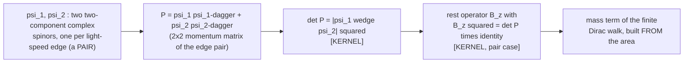

# The null-edge program: brief for adjacent researchers

Audience: physicists and mathematicians outside the program (lattice field
theory, quantum information, causal sets, formal mathematics) who want the
exact claims with hypotheses displayed, at the registry grades.
Scope: exactly the nine headline results of the 2026-07-12 overview packet,
as fixed by the shared claim map
(`AutonomousLab/work/LAB-INFRA/EDU-OVERVIEW-001_claim_map.md`); every claim
below names its row in `AutonomousLab/state/CLAIMS.json`. Results proved
after 2026-07-12 are excluded until the next claim-map revision.
Sibling documents: general-reader packet
(`Sources/Null_Edge_Program_Overview_Packet_2026-07-12.tex`) and the
undergraduate brief (same directory). All three share one claim map and one
figure.

## Evidence model in one paragraph

Grade M ("machine-verified") means: the exact displayed statement is
accepted by the Lean 4 kernel under the pinned toolchain, its axiom
footprint is pinned to `[propext, Classical.choice, Quot.sound]` by a
build-enforced `#guard_msgs in #print axioms` block, and the project build
fails if that pin drifts. M+E discloses an additional trust in the compiled
evaluator for one finite computation. "Draft lane" is kernel-checked code
whose packaging has had less review than the trusted layer. The claim
calculus separates theorem (T), machine-verified program-internal result
(M), conditional statement (T|H), and pre-registered conjecture (C);
interpretation sentences are labeled as such and carry no grade. The kernel
checks proofs, not intended semantics; semantic alignment is a separate,
recorded human/agent review step with named reviewers.

## The shared picture: from light-speed edges to mass

Caption (identical across all three levels): each light-speed constituent
is a two-component spinor. A single spinor spans no area: the wedge
psi wedge psi is zero, the determinant vanishes, and the object is
massless. Two non-parallel spinors span a parallelogram, and the
kernel-checked identity says the squared rest mass of the PAIR is exactly
that squared area, det(P) = |psi_1 wedge psi_2| squared, with the rest
operator squaring to that same number. Reading: mass is not an ingredient
here; it is the geometry of at least two null things failing to be
parallel. Extension (exact, kernel-checked): for an arbitrary family
psi_1, ..., psi_n the determinant is still the sum over pairs
sum_{i<j} |psi_i wedge psi_j| squared, but the rest operator then obeys the
CUBE law B^3 = (budget) times B on a rank-four support block - the scalar
square is the two-edge (n = 2) specialization, not the general law. The
identity is exact at every finite size. It does not predict any particular
mass value and makes no continuum claim.

## The nine results, precisely

1. **Plucker mass-area identity + rest-operator square.** [M]
   (A-PLUECKER-MASS-AREA; A-RESTGEN) For every finite family of
   two-component complex spinors, det(sum_i psi_i psi_i-dagger)
   = sum_{i<j} |psi_i wedge psi_j|^2. For a pair, the canonical odd
   Hermitian rest operator built from the same wedge satisfies
   B_z^2 = det(P) * 1, and the finite Dirac symbol squares to
   k^2 + det(P); the cube law B^3 = mu^2 B holds for arbitrary family
   size with rank-4 support and a non-decomposable control. Anchors:
   `PhysicsSM.Spinor.PluckerMass.fin_bundle_det_eq_ofReal_pluckerMassReal`,
   `two_edge_mass_zero_iff_wedge_zero`,
   `PhysicsSM.Draft.NullEdge.PairModularSelection.Bz_sq` (+ `Bz_cube`).
   Boundary: rank-2 (two-edge) determinant reading; no mass-scale
   selection; no continuum.
2. **Null-entropy dictionary.** [M] (INFO-NULL-ENTROPY) For future-cone
   momentum with positive energy, the von Neumann entropy of the displayed
   observer-conditioned normalized two-level visible-momentum block
   vanishes iff the momentum is null; positive for timelike; log 2 at
   rest. Boundary: the hypotheses (positive energy, future cone,
   displayed block) are part of the statement; no claim about physical
   photon states beyond the model.
3. **Exact interacting two-particle spectrum.** [M+E] (E-SPEC) On the
   four-site ring at the Pythagorean kick, the characteristic polynomial
   of the composed fermionic walk factors into named free levels and a
   palindromic degree-12 factor; the twelve interacting quasienergies
   solve one rational cubic. The evaluator trust is disclosed and confined
   to finite computation. Boundary: one lattice size, one kick; no
   thermodynamic-limit claim.
4. **Doubling census.** [M] (A-DOUBLING-CENSUS) In the displayed
   three-axis split-step architecture, all eight Boolean momentum corners
   carry charge +-1, the two Floquet gaps have opposite charge at every
   corner, and the total over the eight corners is exactly zero; the
   derived capstone census agrees with the landed parity census
   (`SplitStepChargeBalance.census_sum_zero`, `CensusDerivationBridge`).
   Reading: a finite Nielsen-Ninomiya instance - the exact ledger
   prerequisite to any honest evasion attempt. Boundary: the displayed
   architecture; no evasion claim.
5. **Positional defect law.** [M] (C-POS) On the four-site family, the
   reflection-fixed-leg compression is self-adjoint precisely for
   two-wall fields whose lone flip avoids the reflection-fixed sites;
   winding-only explanations are disproved by explicit blind pairs; exact
   multiplicities (2/4/0) certified for all sixteen fields. Boundary:
   family-level classification, displayed ring.
6. **Covariance forcing at block level.** [M] (A-COVARIANCE-FORCED) A
   unitary 2x2 basis change keeping the displayed complex rest-operator
   family covariant at probes z = 1 and z = i must be diagonal or
   antidiagonal; the orientation-preserving branch is, modulo a unimodular
   scalar, exactly a chiral phase; an explicit nontrivial rotation fails
   the condition (nondegeneracy control). This forces the Paper-E quartic
   within the declared family. Boundary: the two probe hypotheses are
   supplied inputs; static/block level only - the full time-dependent
   selection remains open and is said so in the papers.
7. **Everpresent-Lambda fork.** [M; residual open question graded C]
   (LAMBDA-FORK) Wick number-count dichotomy realized by explicit states:
   diagonal/thermal kernels give extensive count variance; an explicit
   Fermi-sea projection kernel (K^2 = K) on region size k^2 has variance
   exactly k/4 - alpha = 1/2, sub-extensive and unbounded (nondegenerate).
   Reading: the mathematical fork is closed; the open item is physical -
   which count the dynamics conjugates to Lambda. A Donoho-Stark-type
   finite uncertainty principle supports the conjugacy picture on finite
   registers. Boundary: no cosmological-constant prediction.
8. **Octonion stabilizer = SU(3).** [M] (FB-SU3) The algebraically
   defined automorphisms of the explicit finite octonion model fixing the
   distinguished imaginary unit are multiplicatively equivalent to SU(3),
   the target submonoid proved EQUAL to `Matrix.specialUnitaryGroup`, and
   the equivalence upgraded to a group isomorphism. Context rows: the
   one-generation package, Z_6 kernel, and two-sided Jordan stabilizer
   characterization. Boundary: a verification of the Furey-Baez algebraic
   core, not a derivation of nature's gauge group.
9. **Free chiral projectors on the tetrahedral regulator.** [M, draft
   lane] (C1-FREE-CHIRAL-PROJECTORS) Under the displayed
   Hermitian-unitary grading, anticommutation, and positive-gap
   hypotheses, the Fourier-transported sign operator is a self-adjoint
   involution and its +-Weyl operators are complementary idempotent
   spectral projectors; with the proved spectral gap and exact
   Ginsparg-Wilson relation this is "handed fermions at the free level".
   Boundary: explicitly denies gauge, anomaly, nonzero-index,
   interaction, and continuum conclusions - those are the hard next
   layer.

## Declared challenges, with their own landed anchors

- **Continuum:** strong L2 convergence of the refining normalized
  cell-average projections is itself kernel-checked, with the compact
  core localized and an exact 6+3 transfer estimate (D-PROJ-L2, [M]);
  open: composition with the live walk, the position-space commuting
  square, high-frequency decoupling.
- **Lorentz:** the fixed-finite-support no-go under the exact rational
  3-4-5 boost is kernel-checked with boundary controls (L0-FINITE-BOOST,
  [M]); open: the distributional invariance theorem for random causal
  orders and its connection to null-edge decorations - the program's
  largest structural debt.
- **Dynamics:** supplied, not derived; the selection theorem (result 6)
  is within a declared family; state/constraint selection from a
  principle is formulated, unproven (gate-D).

## Where to verify

Clone the repository, run `lake build` under the pinned toolchain
(`leanprover/lean4:v4.28.0`), and check any anchor with
`#print axioms <decl>`; the build-enforced guards fail the compile if any
listed result's axiom footprint drifts from the standard three. The claim
registry rows carry the manuscript-usage links.
