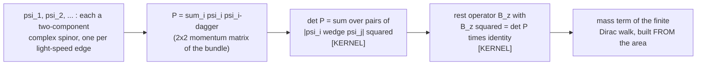

# The null-edge program: undergraduate brief

Audience: a physics or math undergraduate who knows linear algebra, complex
numbers, and a first course of quantum mechanics.
Scope: this brief presents exactly the nine headline results of the
2026-07-12 program overview packet, at the grades fixed by the shared claim
map (`AutonomousLab/work/LAB-INFRA/EDU-OVERVIEW-001_claim_map.md`). Results
proved after 2026-07-12 are deliberately not included; they enter at the
next claim-map revision.
Sibling documents: general-reader packet
(`Sources/Null_Edge_Program_Overview_Packet_2026-07-12.tex`) and the
adjacent-researcher brief (same directory as this file). All three share the
claim map and the figure below.

## How to read the grade chips

Every result carries one of these chips. They are the honesty device; the
prose never claims more than its chip.

- **[KERNEL]** - the statement is checked by the Lean proof kernel down to
  three standard logical axioms, and a build-time guard re-checks that
  every time the project compiles. In program notation this is grade M
  (machine-verified).
- **[KERNEL + evaluator]** - same, except one finite computation step
  trusts the compiled evaluator as well as the kernel (disclosed, and
  narrower than it sounds).
- **[KERNEL, draft lane]** - kernel-checked but living in the draft layer:
  the statement is exact, and its packaging (conventions, intended
  interpretation) has had less review than the trusted layer.

A chip grades the THEOREM, never the physics interpretation next to it.
Sentences beginning "reading:" are interpretation and carry no chip.

## The shared picture: from light-speed edges to mass

Caption (identical across all three levels): each light-speed constituent
is a two-component spinor. A single spinor spans no area: the wedge
psi wedge psi is zero, the determinant vanishes, and the object is
massless. Two non-parallel spinors span a parallelogram; the kernel-checked
identity says the squared rest mass of the bundle is exactly the sum of
those squared areas, and the operator that implements "being at rest"
squares to that same number. Reading: mass is not an ingredient here; it is
the geometry of at least two null things failing to be parallel. The
identity is exact at every finite size. It does not predict any particular
mass value and makes no continuum claim.

## The nine results

1. **Mass is an area.** [KERNEL] (registry rows A-PLUECKER-MASS-AREA,
   A-RESTGEN) For any finite family of two-component spinors, the
   determinant of the summed momentum matrix equals the sum of all pairwise
   squared wedge areas, and the paired rest operator squares to exactly that
   determinant times the identity; a companion cube law B^3 = mu^2 B holds
   for any number of constituents. Not claimed: any specific particle mass,
   any dynamics that selects a mass scale, any continuum statement.
2. **Null edges do not age.** [KERNEL] (INFO-NULL-ENTROPY) For a
   positive-energy, future-pointing momentum, the von Neumann entropy of
   the displayed normalized two-level block is zero exactly when the
   momentum is null, positive when timelike, and log 2 at rest. Reading:
   purity = masslessness = "no internal clock" in the finite model, and
   mass gets a second face as entanglement between null constituents. Not
   claimed: anything about entropy of real photons in the lab; the theorem
   is about the displayed finite block, with its hypotheses shown.
3. **An exactly solved interacting quantum automaton.**
   [KERNEL + evaluator] (E-SPEC) The two-particle spectrum of the composed
   fermionic walk on a four-site ring at one special ("Pythagorean") kick
   is pinned exactly: the characteristic polynomial factors into named free
   levels times a palindromic degree-12 factor whose twelve interacting
   energies solve a single rational cubic. Exact machine-verified
   INTERACTING dynamics is rare in any tradition. Not claimed: large
   systems, continuum limits, or universality.
4. **Exact bookkeeping of fermion doubling.** [KERNEL] (A-DOUBLING-CENSUS)
   Discretizing fermions creates unwanted mirror modes ("doublers"). For
   the program's 3+1 walk, all eight momentum-corner modes are classified
   from the walk's own symbol: each carries charge +1 or -1, the two
   spectral gaps carry opposite charges, and the total is exactly zero - a
   finite, machine-checked instance of the Nielsen-Ninomiya obstruction.
   Not claimed: that the obstruction is evaded; this is the exact ledger
   you need BEFORE an honest evasion attempt.
5. **The positional defect law.** [KERNEL] (C-POS) Where a mass field has
   defects on the four-site ring, the number of trapped modes is NOT set by
   the winding number - explicit counterexample pairs are proved - but by
   a positional rule relative to the reflection-fixed sites, certified with
   exact multiplicities (2, 4, or 0) for all sixteen fields. Not claimed:
   defect laws beyond the displayed family.
6. **The dynamics selects itself, at block level.** [KERNEL]
   (A-COVARIANCE-FORCED) Within the declared static family, any basis
   change preserving the rest-operator construction at two displayed probe
   values must be diagonal or antidiagonal, and the orientation-preserving
   branch is exactly a chiral phase - which forces the specific quartic
   interaction used in result 3. An explicit rotation is proved to FAIL the
   condition (the control). Not claimed: that the full time-dependent
   dynamics is forced; that remains open and the papers say so.
7. **The everpresent-Lambda fork is a theorem.** [KERNEL] (LAMBDA-FORK)
   Whether "everpresent" dark-energy fluctuations survive depends on how a
   fundamental count fluctuates with volume. Both branches are realized by
   explicit fermionic states: thermal-type kernels give extensive variance
   (fluctuations survive), while an explicit Fermi-sea projection kernel on
   region size k^2 has variance exactly k/4 - sub-extensive yet unbounded.
   The fork itself is now a theorem; what remains is the sharply PHYSICAL
   question of which count the dynamics conjugates to Lambda. Not claimed:
   a prediction for the cosmological constant.
8. **SU(3) from the octonions, verified.** [KERNEL] (FB-SU3) The
   automorphisms of an explicit octonion model that fix one distinguished
   imaginary unit are proved multiplicatively equivalent - upgraded to a
   group isomorphism - to SU(3), with the target proved equal to the
   library's standard special unitary group. This gives the
   octonion/Standard-Model literature its first machine-verified common
   core. Not claimed: that nature's color group must arise this way.
9. **Chiral fermions on the regulator.** [KERNEL, draft lane]
   (C1-FREE-CHIRAL-PROJECTORS) On the finite free tetrahedral regulator,
   under displayed grading, anticommutation, and positive-gap hypotheses,
   the transported sign operator is a self-adjoint involution and its
   plus/minus Weyl operators are complementary spectral projectors: the
   regulator carries handed fermions at the free level. Not claimed: gauge
   coupling, index theory, or anomalies - explicitly the hard next layer.

## The three big honest gaps (unchanged from the packet)

- **Continuum limit.** Every theorem lives on a finite structure. Strong
  L2 convergence of the projection ladder is itself kernel-checked
  (registry row D-PROJ-L2), but the full composition with the live walk
  and the position-space "commuting square" remain open.
- **Lorentz invariance.** No fixed finite lattice is Lorentz-invariant,
  and the program has formally withdrawn any such claim; the
  fixed-support no-go under a rational boost is kernel-checked
  (L0-FINITE-BOOST). The intended resolution (invariance in distribution
  over random causal orders) is not yet formalized - the largest
  structural debt.
- **Dynamics is supplied, not derived.** The interaction is SELECTED
  within a declared family (result 6) - but the family itself is a
  choice. Deriving the state and constraints from a principle is
  formulated, unproven work.

## Self-check questions (answers recoverable from this brief alone)

1. What exactly does the chip [KERNEL] certify, and what does it never
   certify?
2. Result 1: what quantity equals the sum of squared wedge areas, and what
   is NOT predicted?
3. Result 4: do the doubler charges cancel, and does that evade
   Nielsen-Ninomiya?
4. Result 7: which half of the Lambda question is settled, and which half
   is open?
5. Which single result is only draft-lane, and what layer is explicitly
   missing from it?
6. Name the largest structural debt the program itself declares.
