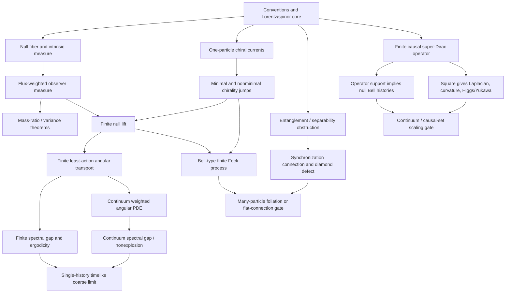

# Lean roadmap for the null-strand Bohm–Bell model

## Purpose

This roadmap turns the proposed null-strand Bohmian theory into a dependency-ordered formalization program. It deliberately separates four kinds of result:

- **BANKED** — stated in the supplied theorem inventory as already kernel-checked or trusted.
- **READY** — a precise finite theorem can be stated and proved now, without resolving open physics.
- **CONDITIONAL** — a mathematically valid theorem should be proved under explicit hypotheses; the physical hypotheses are not yet derived.
- **OPEN** — the correct theorem statement, or the physical structure needed to state it, is not yet known.
- **NO-GO** — a guardrail theorem showing that a tempting stronger claim is false or cannot satisfy all desired conditions simultaneously.

The intended end product is not one enormous theorem. It is a stack of certified interfaces whose top theorem says, conditionally and precisely, when an actual history consists of null segments, has an equivariant Born marginal, and coarse-grains to the ordinary timelike current.

---

## 1. The formal theorem stack



The dependency rule is strict: no continuum or ontology claim is promoted unless every lower box it uses has a Lean theorem with explicit assumptions.

---

## 2. Proposed repository layout

```text
PhysicsSM/
  NullStrand/
    Conventions.lean
    Lorentz4.lean
    HermitianSpinor.lean
    NullFiber/
      Basic.lean
      RestSphere.lean
      FiniteDesign.lean
      IntrinsicMeasure.lean
      FluxMeasure.lean
      ExplicitKernel.lean
      RegulatorNoGo.lean
    ZigZag/
      ChiralCurrent.lean
      TransferCurrent.lean
      MinimalRates.lean
      EntropicTraffic.lean
      LatticeBeable.lean
    NullLift/
      FiniteResolution.lean
      FiniteResidualCurrent.lean
      FiniteLeastAction.lean
      FiniteEquivariance.lean
      ContinuumDensity.lean
      ContinuumLeastAction.lean
    Ergodic/
      RefreshChain.lean
      ReversibleFiniteChain.lean
      SpectralGap.lean
      CoarseTrajectory.lean
      SphereDiffusion.lean
    Clock/
      StrandParameter.lean
      ProperTimeReadout.lean
      InternalHolonomy.lean
    Entanglement/
      ProductNullRepresentation.lean
      SeparabilityObstruction.lean
      ConditionalCurrent.lean
    Synchronization/
      HiddenKernel.lean
      DiamondDefect.lean
      Curvature.lean
      BellPairPilot.lean
    BellQFT/
      FiniteCurrent.lean
      MinimalJumpRates.lean
      FockCutoff.lean
      CreationAnnihilation.lean
      NullLift.lean
    Graph/
      NullContinuation.lean
      BellSupport.lean
      SuperDirac.lean
      Symbol.lean
      LocalityAlternatives.lean
    Master/
      FiniteModel.lean
      FoliatedManyParticle.lean
      ClaimBoundary.lean
```

Existing modules such as `PhysicsSM.Spinor.PluckerMass`, `PhysicsSM.Spinor.Checkerboard`, `PhysicsSM.Spinor.CheckerboardDynamics`, `PhysicsSM.Gauge.CausalDiamondHolonomy`, and the current Dirac/superconnection drafts should be imported rather than redefined.

---

## 3. Stage 0 — conventions and representation firewall

### Goal

Prevent signature drift, normalization drift, and representation conflation.

### Definitions

Use natural units `c = ħ = 1` in the theorem spine. Add a separate units wrapper only after the dimensionless theory is stable.

```lean
abbrev WeylSpinor := Fin 2 → ℂ
abbrev Minkowski4 := Fin 4 → ℝ
abbrev Herm2 := Matrix (Fin 2) (Fin 2) ℂ
```

The actual project may use existing types, but the public API should expose:

```lean
def minkowskiInner : Minkowski4 → Minkowski4 → ℝ
def minkowskiSq (p : Minkowski4) : ℝ := minkowskiInner p p

def IsFuture (p : Minkowski4) : Prop
def IsNull (p : Minkowski4) : Prop := minkowskiSq p = 0
def IsTimelike (p : Minkowski4) : Prop := 0 < minkowskiSq p

def IsUnitFutureTimelike (u : Minkowski4) : Prop :=
  IsFuture u ∧ minkowskiSq u = 1
```

### Mandatory irrep table

| Object | Lean home | Representation | Meaning |
|---|---|---|---|
| `ψ ∧ χ` | alternating bilinear map on `WeylSpinor` | `Λ²S ≃ ℂ` | scalar Plücker amplitude |
| `P = Σ ψψ†` | Hermitian `2×2` matrix | `S ⊗ S̄` | four-momentum |
| self-dual curvature | symmetric spinor | `Sym²S` | gauge/gravity curvature |
| spacetime bivector | exterior square of four-vector space | `Λ²ℂ⁴` | Klein quadric / simplicity |

### READY theorems

```lean
pauliHermitianEquiv_apply
hermitian_det_eq_minkowskiSq
rankOneHermitian_iff_futureNull
sl2_congruence_preserves_det
```

### Promotion gate

No theorem may use the phrase “bivector”, “mass”, “curvature”, or “simplicity” without naming which row of the irrep table it inhabits.

---

## 4. Stage 1 — reuse and consolidate the banked finite spine

According to the supplied inventory, the following are already present in trusted or kernel-checked form:

- finite checkerboard histories and dynamics;
- finite Plücker mass and zero-mass/common-direction criterion;
- spinor-chart twistor/Plücker matching;
- finite Yukawa gauge-legality predicates;
- causal-diamond holonomy invariance and composition;
- static Dirac slash square root;
- bundle Dirac–Plücker bridge;
- abstract super-Dirac block-square and superconnection expansion;
- finite two-sheet projectors and mass-shell projectors;
- observer-channel determinant and purity guardrails.

### Immediate consolidation tasks

1. Replace duplicated draft definitions by one public `NullStrand.Conventions` API.
2. Make every trusted theorem state its metric signature and normalization through typeclass arguments or explicit parameters.
3. Add deprecation aliases before renaming theorem surfaces.
4. Create a single import:

```lean
import PhysicsSM.NullStrand.FiniteCore
```

that exposes only reviewed declarations.

### READY wrapper theorem

```lean
theorem finiteCore_staticMassSquareRoot
    (ψ : ι → WeylSpinor) :
    (chiralDiracSlash (bundleMomentum ψ)) ^ 2 =
      finPairwisePluckerMass ψ • 1 := by
  -- compose the banked bundle Dirac–Plücker theorem
  ...
```

This wrapper should be the static entry point for the Bohmian model.

---

## 5. Stage 2 — the covariant null fiber

### 5.1 Primitive fiber

For a unit future timelike `U`, define

```lean
structure NullFiber (U : Minkowski4) where
  k : Minkowski4
  future : IsFuture k
  null : minkowskiSq k = 0
  normalized : minkowskiInner U k = 1
```

Define the rest-sphere fiber

```lean
structure RestSphere (U : Minkowski4) where
  ξ : Minkowski4
  orthogonal : minkowskiInner U ξ = 0
  unitSpacelike : minkowskiSq ξ = -1
```

and the maps

```lean
def restToNull (ξ : RestSphere U) : NullFiber U := ⟨U + ξ.ξ, ...⟩
def nullToRest (k : NullFiber U) : RestSphere U := ⟨k.k - U, ...⟩
```

### READY theorems

```lean
nullFiber_equiv_restSphere
restToNull_isFutureNull
nullToRest_tangent
nullFiber_nonempty
```

These are finite algebra and should be proved before any measure theory.

### 5.2 Finite exact design pilot

Before formalizing Haar measure, define the six octahedral rest directions `±e₁, ±e₂, ±e₃` and prove

```lean
octaDirection_sum_eq_zero
octaDirection_secondMoment_eq_oneThird
octaNull_mean_eq_timelike
```

This gives an exact finite resolution

```text
U = (1/6) Σₐ (U + ξₐ)
```

into null vectors. The octahedral design is preferable for the first Lean implementation because its coordinates are rational and its first two moments are exact. A four-direction tetrahedral design can be added later as a smaller comparison instance.

### 5.3 Intrinsic measure

Define the induced positive Euclidean metric on `U⊥` by `-η`, take its normalized sphere measure, and push it through `ξ ↦ U+ξ`:

```lean
def restSphereMeasure (U) : Measure (RestSphere U)
def intrinsicNullMeasure (U) : Measure (NullFiber U) :=
  (restSphereMeasure U).map restToNull
```

### CONDITIONAL/FOUNDATIONAL theorems

```lean
intrinsicNullMeasure_isProbability
intrinsicNullMeasure_littleGroupInvariant
intrinsicNullMeasure_firstMoment
intrinsicNullMeasure_lorentzCovariant
```

The key statement is

```lean
theorem intrinsicNullMeasure_firstMoment (U) :
  ∫ k, k.k ∂intrinsicNullMeasure U = U
```

The proof should use symmetry of the sphere measure rather than an explicit coordinate integral.

### Alternative spinor construction

A later module may construct the same measure by choosing `A ∈ SL(2,ℂ)` with `U = A A†`, pushing forward the Fubini–Study measure on `ℂP¹`, and proving independence under `A ↦ AR`, `R ∈ SU(2)`.

This is a comparison theorem, not the first implementation target:

```lean
spinorPushforward_eq_intrinsicNullMeasure
```

---

## 6. Stage 3 — observer flux measure and the mass-ratio theorem

### 6.1 Observer decomposition

For a unit future timelike observer `n`, define

```lean
def observerEnergy (n : Observer) (k : FutureNull) : ℝ := minkowskiInner n k

def spatialDirection (n : Observer) (k : FutureNull) : n.RestSpace :=
  k / observerEnergy n k - n
```

Prove

```lean
spatialDirection_orthogonal
spatialDirection_norm_eq_one
```

### 6.2 Flux weighting

```lean
def fluxMeasure (U n) : Measure (NullFiber U) :=
  (intrinsicNullMeasure U).withDensity
    (fun k => ENNReal.ofReal (minkowskiInner n k.k / minkowskiInner n U))
```

### READY once the first-moment theorem exists

```lean
fluxMeasure_isProbability
fluxDirectionMean_eq_relativeVelocity
```

Coordinate-free target:

```lean
theorem fluxDirectionMean_eq_relativeVelocity (U n) :
  ∫ k, spatialDirection n k.k ∂fluxMeasure U n =
    U / minkowskiInner n U - n
```

### READY variance theorem

Once the mean theorem is available, this is elementary:

```lean
theorem fluxDirectionVariance_eq_massRatioSq (U n) :
  ∫ k, ‖spatialDirection n k.k - relativeVelocity U n‖ ^ 2
      ∂fluxMeasure U n
    = 1 / (minkowskiInner n U) ^ 2
```

For `p = mU`, this becomes

```lean
massRatio_sq_eq_fluxDirectionVariance
massRatio_eq_sqrt_fluxDirectionVariance
```

and should connect to the banked visible-density determinant:

```lean
two_sqrt_det_normalizedVisible_eq_fluxDirectionStdDev
```

### Explicit laboratory kernel

The density formulas with powers `2` and `3` in the aberration and flux kernels should be a later coordinate theorem:

```lean
intrinsicNullMeasure_lab_density
fluxMeasure_lab_density
```

Do not make the coordinate formulas prerequisites for the invariant construction.

---

## 7. Stage 4 — regulator and boundary no-go theorems

The correct formal lesson is not “choose a radius regulator”. It is that exact mean matching near the unit sphere is incompatible with a uniform positive floor.

### 7.1 Finite convex version — READY

For a probability mass function on unit vectors:

```lean
theorem uniformComponent_bounds_meanNorm
    (μ q : PMF Ω) (ε : ℝ)
    (hμ : μ = ε • uniform + (1 - ε) • q)
    (hε : 0 ≤ ε) (hε1 : ε ≤ 1) :
    ‖expectation μ direction‖ ≤ 1 - ε
```

### 7.2 Measure version — CONDITIONAL

```lean
uniformAngularFloor_bounds_meanNorm
```

This will require a Radon–Nikodym decomposition or an explicit density hypothesis.

### 7.3 Strict-boundary theorem

A stronger and conceptually useful target is:

```lean
meanNorm_eq_one_iff_dirac
```

for probability measures supported on a strictly convex unit sphere. Begin with finite support; generalize only when needed.

### Consequence

The massless limit must be represented as a singular boundary sector, not by a uniformly elliptic family with exact first moment.

---

## 8. Stage 5 — one-particle chiral zig-zag dynamics

### 8.1 Algebraic current layer

Define the Weyl currents and prove nullity pointwise:

```lean
def rightCurrent (φ : WeylSpinor) : Minkowski4
def leftCurrent  (φ : WeylSpinor) : Minkowski4

theorem rightCurrent_futureCausal
leftCurrent_futureCausal
rightCurrent_futureNull_of_ne_zero
leftCurrent_futureNull_of_ne_zero
```

These should reuse the spin-coherent and Weyl–Clifford modules.

### 8.2 Transfer-current interface

Do not initially formalize the Dirac PDE. Define an abstract interface:

```lean
structure ChiralTransferData where
  ρR ρL : X → ℝ
  jR jL : X → V
  F : X → ℝ
  continuityR : ... = F
  continuityL : ... = -F
  nonnegR : 0 ≤ ρR x
  nonnegL : 0 ≤ ρL x
```

Prove all stochastic statements from this interface. Instantiate it with Dirac/Weyl solutions later.

### 8.3 Minimal rates — READY pointwise

```lean
def rateLtoR (d : ChiralTransferData) (x) := (d.F x)⁺ / d.ρL x
def rateRtoL (d : ChiralTransferData) (x) := (-d.F x)⁺ / d.ρR x
```

Use safe division conventions and prove the source vanishes when the denominator density vanishes.

```lean
minimalRates_nonneg
minimalRates_netTransfer
minimalRates_masterEquation
minimalRates_equivariant
```

### 8.4 Dirac instantiation — CONDITIONAL

```lean
dirac_chiralContinuity
dirac_massTransfer_eq_two_m_im_inner
```

This requires a clean differentiability/PDE API. It should not block the finite stochastic theory.

### 8.5 Entropic nonminimal traffic — READY algebra, analysis later

For `a - b = J` and reference traffic `s₀ > 0`, define the relative-entropy cost and prove the optimizer

```text
a = (J + sqrt(J² + 4s₀²))/2
b = (-J + sqrt(J² + 4s₀²))/2
ab = s₀².
```

Targets:

```lean
entropicTraffic_feasible
entropicTraffic_product_eq_referenceSq
entropicTraffic_uniqueMinimizer
entropicTraffic_tendsTo_minimal
```

The first two are READY. The global minimizer theorem requires convex-analysis details.

---

## 9. Stage 6 — exact finite lattice beable model

This should be the first fully closed model.

### Definitions

- two-component lattice wavefunction;
- local coin `Cθ`;
- conditional null shift;
- actual state `(position, chirality)`;
- minimal Born-weight transport through the coin.

### BANKED inputs

The supplied inventory reports norm preservation, checkerboard transfer recursions, and Klein–Gordon-style recurrence theorems.

### READY additions

```lean
coinBornTransport_isStochastic
coinBornTransport_sourceMarginal
coinBornTransport_targetMarginal
actualShift_speed_eq_c
latticeBeable_oneStep_equivariant
latticeBeable_nStep_equivariant
```

### Continuum-rate theorem

```lean
coinTransfer_firstOrderExpansion
coinRate_tendsto_continuumZigZagRate
```

Keep this as a calculus theorem about `τ → 0`; do not call it a full continuum-limit theorem.

### Dispersion theorem

```lean
quantumWalk_quasienergy_relation
quantumWalk_diracDispersion_secondOrder
```

The finite quasienergy identity is READY. The physical interpretation of a nonzero fundamental `τ` is a separate claim boundary.

---

## 10. Stage 7 — generic finite null lift

This is the core representation theorem in a form Lean can complete without manifold analysis.

### 10.1 Null resolution interface

```lean
structure FiniteNullResolution (Z Ω : Type*) [Fintype Ω] where
  weight : Z → Ω → ℝ
  nonneg : 0 ≤ weight z ω
  normalized : ∑ ω, weight z ω = 1
  direction : Z → Ω → V
  unitDirection : ‖direction z ω‖ = 1
  mean_eq : ∑ ω, weight z ω • direction z ω = baseVelocity z
```

### 10.2 Extended density

```lean
def extendedDensity (ρ : Z → ℝ) (R : FiniteNullResolution Z Ω) : Z × Ω → ℝ :=
  fun zω => ρ zω.1 * R.weight zω.1 zω.2
```

### 10.3 Residual current construction — READY

For finite `Ω` and residual `G` with `Σ G = 0`, define the surplus/deficit transport current. Prove:

```lean
residualCurrent_antisymm
residualCurrent_divergence_eq
minimalAngularRates_nonneg
minimalAngularRates_masterEquation
finiteNullLift_equivariant
```

This is the finite version of the DGTZ/Bell current construction and is one of the highest-priority formalization targets.

---

## 11. Stage 8 — finite least-action angular dynamics

The continuum weighted Laplace–Beltrami equation should first be proved as a finite graph theorem.

### 11.1 Direction graph

Let `Γ` be a connected finite graph on the angular states. Let `f(ω)>0` be the target density. Define gradient, weighted flux, divergence, and weighted Laplacian.

```lean
def angularGradient
def weightedAngularFlux
def angularDivergence
def weightedAngularLaplacian
```

### 11.2 Variational problem

Minimize

```text
E(b) = 1/2 Σ_edges f_edge * b_edge²
```

subject to

```text
div(f b) = -G.
```

### READY/FOUNDATIONAL finite theorems

```lean
weightedLaplacian_selfAdjoint
weightedLaplacian_nonneg
weightedLaplacian_kernel_eq_constants
zeroSum_iff_mem_weightedLaplacian_range
weightedPotential_exists_unique_mod_constants
leastActionDrift_eq_gradient
leastActionDrift_unique
leastActionDrift_equivariant
```

This is where finite-dimensional spectral theory should be used. It removes the arbitrary choice of angular current once the graph, metric, and continuous-flow ansatz are fixed.

### Claim boundary

The theorem does **not** select:

- the direction graph;
- continuous flow over jump dynamics;
- the target null-resolution measure;
- a Compton mixing scale.

Those remain separate postulates or derivations.

---

## 12. Stage 9 — finite spectral gap and realized coarse motion

Claude’s strongest new criticism belongs here: a static null decomposition is only an ensemble statement. A single realized history becomes timelike only after an ergodic/mixing theorem.

### 12.1 Exactly solvable refresh chain — READY

Define

```text
P = (1-r) I + r Π
```

where `Π` redraws the direction from the target distribution.

Prove:

```lean
refreshKernel_invariant
refreshKernel_reversible
refreshKernel_eigen_on_meanZero
refreshKernel_spectralGap_eq_r
refreshKernel_correlation_eq_pow
```

This gives an exact finite Compton-locked model by choosing a dimensionless per-tick refresh probability derived from the mass parameter.

### 12.2 Reversible finite chain — READY with spectral infrastructure

```lean
finiteReversible_poincareGap_pos_of_irreducible
finiteReversible_poincare
finiteLazyReversible_absoluteGap_pos
finiteLazyReversible_L2_convergence
```

Use a weighted `L²(π)` inner product and the finite-dimensional self-adjoint spectral theorem. Irreducibility gives a positive Poincaré gap, but convergence of `Pⁿ` also needs laziness/aperiodicity or an absolute spectral-gap hypothesis; a period-two chain is the standard guardrail.

### 12.3 Pathwise law — two-step plan

First prove the independent-direction model. If the needed vector-valued strong law is not already in the project API, begin with an explicit second-moment bound, convergence in probability, and then a scalar-coordinate strong-law wrapper:

```lean
iidNullSteps_empiricalDirection_tendsto_mean
iidNullTrajectory_coarseVelocity_tendsto_timelike
```

Then add a finite-state Markov-chain strong law:

```lean
finiteIrreducibleMarkov_empiricalMean_tendsto
finiteNullMarkovTrajectory_coarseVelocity_tendsto
```

The second theorem may require new mathlib-level work.

### 12.4 Exact rest-sphere diffusion gap — CONDITIONAL

For the continuum rest generator `D Δ_{S²}`, the coordinate functions are `l=1` eigenfunctions with eigenvalue `-2D`, giving

```lean
restSphere_coordinate_eigenvalue
restSphere_directionCorrelation_eq_exp
```

This should be formalized only after the sphere Laplacian API exists.

### Crucial claim boundary

`D_m = αm` is a postulate until derived from the first-order mass/Yukawa operator. Formalize the consequences for arbitrary `D_m`; define “Compton locking” as a separate structure containing the equality.

---

## 13. Stage 10 — continuum least-action dynamics

This is an analysis project, not an early dependency.

### 13.1 Weak formulation

Avoid pointwise division by the density. Work on zero-mean Sobolev functions and solve

```text
∫ f ⟪∇ψ, ∇φ⟫ = ∫ G φ
```

for all test functions `φ`.

### Proposed structures

```lean
structure AngularDensity where
  f : Sphere → ℝ
  measurable : ...
  lower : ∃ c > 0, ∀ᵐ ω, c ≤ f ω
  upper : ...

structure ResidualSource where
  G : Sphere → ℝ
  zeroMean : ∫ G = 0
  squareIntegrable : ...
```

### CONDITIONAL theorem

```lean
weightedAngularPoisson_exists_unique
```

Proof route: quotient by constants, prove coercivity using a Poincaré inequality, then apply Lax–Milgram.

### Additional theorem gates

```lean
weightedAngularGenerator_closable
weightedAngularGenerator_markov
weightedAngularGenerator_spectralGap
weightedAngularProcess_nonexplosive
weightedAngularProcess_ergodic
```

These are not one theorem. Each needs explicit smoothness, positivity, compactness, and boundary hypotheses.

### Massless boundary

No uniform gap should be claimed as `m → 0`. The honest target is a parameterized theorem:

```lean
spectralGap_pos_of_mass_pos_and_uniformEllipticity
spectralGap_tendsto_zero_allowed_at_masslessBoundary
```

The exact dependence of the gap on `m` is OPEN outside the homogeneous rest model.

---

## 14. Stage 11 — strand parameter, effective proper time, and internal holonomy

### 14.1 Strand parameter — READY kinematics

For `k ∈ NullFiber U`, define the scalar parameter by

```text
dX = k ds,   U·k = 1.
```

Targets:

```lean
strandParameter_lorentzScalar
observerTime_derivative_eq_inner
fluxMean_strandRate_eq_invGamma
```

The last theorem is an expectation identity:

```lean
Eπ[ds/dt] = 1/(n·U).
```

### 14.2 Pathwise proper-time readout — CONDITIONAL

A pathwise statement requires the Stage 9 ergodic theorem:

```lean
strandClock_longRunRate_eq_coarseProperTimeRate
```

Do not infer this from the one-time expectation alone.

### 14.3 Internal holonomy

For a matrix-valued mass/Yukawa operator `M(x)`, define a discrete path-ordered product first:

```lean
def internalHolonomy (path : Fin (N+1) → X) : Matrix d d ℂ :=
  orderedProduct (fun i => exp (-I * Δs i • M (path i)))
```

READY finite theorems:

```lean
internalHolonomy_concat
internalHolonomy_unitary_of_hermitian
internalHolonomy_gaugeCovariant
commutingMass_internalHolonomy_eq_exp_sum
```

OPEN physical gate:

```lean
internalHolonomy_controls_directionOrChiralityTransition
```

A passive absolute phase is not promoted as an observable clock. Only relative holonomy or a demonstrated coupling to beable transitions counts as physical content.

---

## 15. Stage 12 — entanglement obstruction

### 15.1 Product-null representation

For a qubit direction `ω`, define the pure projector

```lean
def pureDirectionProjector (ω : Sphere) : Matrix (Fin 2) (Fin 2) ℂ :=
  (1/2) • (1 + pauliDot ω)
```

For `N` particles, define a positive product-null representation as a probability measure or finite convex combination of tensor products of these projectors.

### READY finite theorem

```lean
productPureProjectorMixture_isSeparable
```

### READY converse, given the projective-qubit parametrization

```lean
separableQubitState_has_productDirectionRepresentation
```

Combined target:

```lean
productDirectionRepresentation_iff_separable
```

Begin with finite convex combinations. General measure-valued formulations are optional.

### NO-GO corollary

```lean
entangledState_has_no_localPositiveProductNullRepresentation
```

This theorem says the hidden null directions cannot replace the entangled wavefunction with a local classical distribution.

---

## 16. Stage 13 — synchronization connection and Bell-pair pilot

### 16.1 Hidden transition kernel

For a quantum state `Ψ` and a local update `A`, define a hidden-variable Markov kernel

```lean
def hiddenUpdateKernel (Ψ) (A) : Kernel Hidden Hidden
```

The exact construction may be the minimal Bell kernel, least-action coupling, or another named rule. The rule is part of the theorem statement.

### 16.2 Diamond defect

For spacelike commuting quantum updates `A` and `B`:

```lean
def synchronizationDiamondDefect : KernelDifference :=
  K (A Ψ) B ∘ K Ψ A - K (B Ψ) A ∘ K Ψ B
```

Targets:

```lean
quantumUpdates_commute
synchronizationDiamondDefect_eq_zero_iff_orderIndependent
synchronizationDiamondDefect_vanishes_for_productKernel
```

### Bell-pair computation

Define a fixed Bell state and two explicit local gates. Compute the two composite hidden kernels exactly.

```lean
bellPair_localGateA
bellPair_localGateB
bellPair_minimalKernel_defect
bellPair_leastActionKernel_defect
```

This should be a finite, executable theorem/computation, not a continuum argument.

### Important non-theorem

Do **not** initially state

```lean
separabilityObstruction_iff_synchCurvatureNonzero
```

It is not yet well-posed. Curvature depends on the selected hidden connection, and a nonzero defect can occur for reasons unrelated to entanglement. The safe research questions are:

1. Under which locality, positivity, covariance, and state-dependence axioms does flatness imply a product-null representation?
2. Under those same axioms, does entanglement force nonzero curvature?
3. Can a positive, flat, explicitly nonlocal connection exist?

Only after these axioms are fixed should an equivalence theorem be proposed.

---

## 17. Stage 14 — many-particle foliated null theory

### Conditional current matrix

For each particle and chirality branch, define the positive `2×2` conditional current matrix by tracing over all remaining spin/internal indices.

Targets:

```lean
conditionalCurrent_posSemidefinite
conditionalCurrent_det_nonneg
conditionalCurrent_rankOne_iff_pureLocalWeylState
conditionalCurrent_timelike_of_det_pos
```

Resolve each matrix by the Stage 2 null fiber and Stage 3 flux measure.

### Foliated extended equilibrium

```lean
def foliatedExtendedDensity
```

Prove, conditionally on the base hypersurface Bohm–Dirac continuity equation:

```lean
foliatedNullLift_positionMarginal
foliatedNullLift_eachTangent_null
foliatedNullLift_equivariant
```

### OPEN gate

Either accept a fixed/state-generated foliation, or prove a flat synchronization connection. The formalization should support both branches without claiming that one has been selected by known physics.

---

## 18. Stage 15 — finite Bell-type QFT

### 18.1 Finite Hilbert/Fock cutoff

Use a finite configuration type `Q`, a finite-dimensional Hilbert space, orthogonal configuration projectors `P q`, a self-adjoint Hamiltonian `H`, and state `ψ`.

Define

```lean
def quantumCurrent (q q' : Q) : ℝ :=
  2 * Complex.im ⟪ψ, P q * H * P q' * ψ⟫
```

### READY theorems

```lean
quantumCurrent_antisymm
quantumCurrent_sum_eq_continuityRhs
minimalBellRate_nonneg
minimalBellRate_masterEquation
minimalBellRate_equivariant
```

### 18.2 Creation/annihilation

Represent Fock sectors by a finite disjoint union. Prove that sector-changing transitions preserve total probability and that new direction variables are sampled from the destination null-resolution kernel.

```lean
creationLift_targetDirectionMarginal
annihilationLift_forgetsDirection
fockNullLift_equivariant
```

### Continuum/QFT boundary

Renormalized infinite-dimensional QFT is outside the first formal target. The formal theorem should be explicitly named `FiniteCutoffBellQFT`.

---

## 19. Stage 16 — graph operator and null-support theorem

### 19.1 Null-continuation relation

```lean
def IsNullContinuation (q q' : Configuration) : Prop
```

The relation should distinguish:

- propagation along an allowed null edge;
- local chirality/flavor change at the same vertex;
- local creation or annihilation.

### 19.2 Operator support

```lean
def SupportedOnNullContinuations (D) : Prop :=
  ∀ q q', ¬ IsNullContinuation q q' → P q * D * P q' = 0
```

### READY theorem

```lean
theorem operatorSupport_implies_bellCurrentSupport
    (hD : SupportedOnNullContinuations D) :
    quantumCurrent D ψ q q' ≠ 0 → IsNullContinuation q q'
```

and therefore

```lean
minimalBellHistories_supportedOnNullContinuations
```

This theorem is intentionally simple. It is a support-transfer lemma, not the physics breakthrough.

### Actual operator gate

Construct

```text
D_total = D_U + Γ_K M_Φ
```

and prove:

```lean
superDirac_isOdd
superDirac_kreinSelfAdjoint
superDirac_sq_decomposition
superDirac_symbol_eq_nullSlash
superDirac_symbol_sq_eq_weightedPluckerMass
superDirac_supportedOnNullContinuations
```

The last three together are the interpretation-to-theory gate.

---

## 20. Stage 17 — causal-set locality alternatives

Do not formalize “covariant causal-set d’Alembertians are necessarily nonlocal” as a theorem. The literature now contains both established retarded nonlocal constructions and a recent proposal for an intrinsic local convergent d’Alembertian.

Formalize two interfaces:

```lean
structure RetardedNonlocalCausetOperator where
  support : CausalPastSupport
  lorentzInvariantInLaw : Prop
  infraredLimit : Prop

structure IntrinsicLocalCausetOperator where
  neighborhood : IntrinsicDistanceNeighborhood
  localSupport : Prop
  continuumConvergence : Prop
```

### Comparative theorem targets

```lean
nonlocalBox_support_characterization
localBox_support_characterization
operatorClass_bellContinuationSupport
squareOfNullLocalDirac_supportRadius_le_two
```

### OPEN master question

```lean
exists_covariant_nullLocal_firstOrder_with_correctContinuumSquare
```

This is a research question, not a theorem to assume. A negative result would require precise axioms. A positive result must exhibit the operator and prove its limit.

The regular layered graph and Lorentz-invariant causal-set branches should remain separate namespaces until this gate is resolved.

---

## 21. Master theorem packages

### 21.1 Finite complete model — realistic first endpoint

```lean
structure FiniteNullStrandModel where
  configuration : Type
  direction : Type
  waveEvolution : ...
  bornDensity : ...
  nullResolution : FiniteNullResolution ...
  hiddenGenerator : ...
  equivariant : Prop
  nullMotion : Prop
  mixing : Prop
```

Target:

```lean
theorem finiteNullStrand_master
    (M : FiniteNullStrandModel) :
    M.eachContinuousStepIsNull ∧
    M.positionMarginalIsBorn ∧
    M.empiricalVelocityConvergesToBaseCurrent
```

This can be completely rigorous with a finite refresh chain or another explicitly ergodic finite kernel.

### 21.2 Foliated many-particle theorem — conditional endpoint

```lean
theorem foliatedManyParticleNullStrand_master
    (continuity : HypersurfaceContinuity Ψ)
    (angularExistence : ...)
    (ergodic : ...)
    (nonexplosive : ...) :
    ...
```

Every analytic and foliation assumption must appear in the theorem signature.

### 21.3 Graph-derived theorem — genuine new-physics endpoint

```lean
theorem causalSuperDirac_master
    (symbol : LocalNullSymbol D)
    (square : CorrectSuperDiracSquare D)
    (support : SupportedOnNullContinuations D)
    (scaling : ContinuumDiracLimit D) :
    ...
```

Until `symbol`, `square`, and `scaling` are proved for one concrete operator, the graph theory remains a conditional program.

---

## 22. Theorem manifest: what can be filled now

### Highest-priority READY cluster

1. `nullFiber_equiv_restSphere`
2. `octaNull_mean_eq_timelike`
3. `fluxDirectionMean_eq_relativeVelocity` from the intrinsic first moment
4. `fluxDirectionVariance_eq_massRatioSq`
5. `uniformComponent_bounds_meanNorm`
6. `rightCurrent_futureCausal`, `leftCurrent_futureCausal`, with strict-null corollaries under nonzero-spinor hypotheses
7. `minimalRates_netTransfer`
8. `coinBornTransport_isStochastic`
9. `latticeBeable_oneStep_equivariant`
10. `residualCurrent_divergence_eq`
11. `finiteNullLift_equivariant`
12. `weightedLaplacian_kernel_eq_constants`
13. `leastActionDrift_unique`
14. `refreshKernel_spectralGap_eq_r`
15. `iidNullTrajectory_coarseVelocity_tendsto_timelike`
16. `productDirectionRepresentation_iff_separable` for finite mixtures
17. `quantumCurrent_antisymm`
18. `minimalBellRate_masterEquation`
19. `operatorSupport_implies_bellCurrentSupport`
20. `synchronizationDiamondDefect_eq_zero_iff_orderIndependent`

### CONDITIONAL cluster with known theorem shape

1. `intrinsicNullMeasure_firstMoment`
2. `intrinsicNullMeasure_lorentzCovariant`
3. `dirac_chiralContinuity`
4. `weightedAngularPoisson_exists_unique`
5. `weightedAngularGenerator_spectralGap`
6. `weightedAngularProcess_nonexplosive`
7. `finiteIrreducibleMarkov_empiricalMean_tendsto`
8. `foliatedNullLift_equivariant`
9. `internalHolonomy_gaugeCovariant`
10. `superDirac_symbol_sq_eq_weightedPluckerMass`

### OPEN theorem registry

| ID | Proposed claim | What must be found first |
|---|---|---|
| O1 | exact Compton spectral gap for the full covariant generator | the actual generator and its invariant density |
| O2 | uniform continuum nonexplosion away from nodes | regularity and lower-bound hypotheses compatible with the physical wavefunction |
| O3 | entanglement obstruction iff synchronization curvature | axioms relating flat hidden transport to local product representations |
| O4 | foliation-free positive nonlocal hidden connection | an explicit connection or a no-go theorem under precise axioms |
| O5 | mass/Yukawa operator uniquely selects symmetric traffic | a variational or operator derivation of the traffic law |
| O6 | internal holonomy is an operational clock | a coupling from holonomy to observable transition records |
| O7 | null-local, Lorentz-covariant, continuum-correct causal Dirac operator | a concrete operator or a precise impossibility theorem |
| O8 | graph super-Dirac square yields the desired continuum QFT | scaling/renormalization theorem |
| O9 | bosonic gauge sectors admit the same particle-null ontology | a gauge-invariant localization/primitive ontology |
| O10 | observed masses are derived rather than inserted | an internal/Yukawa spectrum theorem |

---

## 23. Lean engineering policy

### One theorem, one claim boundary

Each physics-facing theorem file should begin with a charter:

```text
State space:
Primitive variables:
Operator/kernel:
Measure/density:
Covariance group:
Assumptions:
Formal theorem:
Physical interpretation:
What is not proved:
Falsifier:
```

### No hidden use of `sorry`

- `Draft` modules may use named axioms only when the mathematical assumption is itself the object under study.
- Public theorem modules must contain no `sorry`, no `admit`, and no opaque external oracle.
- Numerical scripts may suggest constants and counterexamples but never discharge trusted proof obligations.

### Finite before continuum

Every continuum theorem should have a finite analogue or finite regression model. In particular:

- finite angular graph before sphere PDE;
- finite refresh chain before diffusion spectral gap;
- finite Bell-pair diamond before hypersurface curvature;
- finite Fock cutoff before QFT;
- regular null walk before causal-set scaling.

### Assumptions as structures

Avoid anonymous hypotheses spread over theorem signatures. Package them as named structures such as:

```lean
structure UniformAngularEllipticity ...
structure ReversibleDirectionGenerator ...
structure HypersurfaceContinuity ...
structure LocalNullSymbol ...
structure CorrectSuperDiracSquare ...
structure ContinuumScalingLimit ...
```

This makes it immediately visible whether a result is mathematical content or merely an unpacking of assumptions.

---

## 24. Practical proof order

### First proof batch

- conventions and `NullFiber ↔ RestSphere`;
- octahedral finite null resolution;
- abstract flux-weighting mean and variance;
- regulator no-go in finite support;
- finite residual-current construction;
- exact lattice beable equivariance;
- finite Bell current and minimal rate algebra.

### Second proof batch

- finite weighted least-action theorem;
- refresh-chain spectral gap and exact correlation;
- iid pathwise coarse-velocity theorem;
- finite separability obstruction;
- Bell-pair synchronization-defect computation.

### Third proof batch

- intrinsic sphere measure and first moment;
- Lorentz covariance of the measure;
- finite Markov-chain ergodic theorem;
- internal holonomy algebra;
- many-particle conditional-current matrices.

### Fourth proof batch

- weak weighted angular PDE via Lax–Milgram;
- continuum spectral gap under uniform ellipticity;
- nonexplosion/ergodicity;
- foliated many-particle master theorem.

### Fifth proof batch

- concrete causal super-Dirac symbol theorem;
- operator support theorem instantiated on the graph;
- comparative regular-graph and causal-set scaling studies.

---

## 25. Success criteria

The formalization earns progressively stronger claims only at these gates:

### Gate A — exact finite interpretation

Proved when there is a finite model with:

- null step at every tick;
- unitary wave evolution;
- exact equivariance;
- a well-defined actual trajectory;
- a pathwise coarse velocity theorem.

### Gate B — relativistic one-particle continuum model

Adds:

- intrinsic covariant null measure;
- flux-weighted observer current;
- global process existence;
- spectral gap/ergodicity for positive mass;
- correct massless boundary behavior.

### Gate C — many-particle Bohmian QFT

Adds:

- entangled conditional currents;
- creation/annihilation at finite cutoff;
- either an explicit foliation or a proved flat hidden connection;
- equivariance and nonexplosion.

### Gate D — graph-derived physical theory

Adds:

- one concrete first-order graph operator;
- null-continuation support;
- correct super-Dirac square;
- correct continuum/scaling limit;
- a prediction or constraint not inserted by hand.

Only Gate D upgrades the program from an empirically equivalent ontology to a candidate new dynamics.

---

## 26. Corrections and refinements prompted by Claude’s latest feedback

1. **Ergodicity is load-bearing only for single-history limits.** The one-time identity
   `Eπ[ds/dt] = 1/(n·U)` follows directly from flux weighting and does not require a spectral gap. The almost-sure or long-run statement for one realized clock does require mixing/ergodicity. These must remain separate theorem names.

2. **`comptonLockedGenerator_spectralGap` is not a universal theorem as currently phrased.** For the homogeneous rest generator it is exact. For a general state-dependent, possibly nonreversible and time-dependent generator, a gap requires explicit ellipticity, regularity, invariant-density, and irreducibility assumptions. The formal API should therefore use a certificate such as `HasSpectralGap L μ γ` and only later construct it in named models.

3. **The causal-set issue is an audit, not a settled impossibility theorem.** Established generalized causal-set boxes are retarded, Lorentz-invariant, and nonlocal, while a 2025 construction proposes a local intrinsic d’Alembertian with a continuum-convergence theorem. Lean should compare precisely defined operator classes rather than encode a blanket no-go.

4. **`separabilityObstruction_iff_synchCurvatureNonzero` is too strong without extra axioms.** The safe theorem is that a positive local product-null representation implies separability. Synchronization curvature depends on the selected hidden connection. A Bell-pair defect calculation tests that connection, not every possible positive nonlocal connection.

5. **A null-local first-order operator does not make its square nearest-neighbor local.** Its square is supported on the relational two-step closure. Formalize `support (D²) ⊆ R ∘ R`, then compare that support with the desired effective box operator.

6. **Nonlocal effective operators may admit null-local dilations.** Add the open interface

```lean
structure NullDilation (L : Matrix Q Q ℂ) where
  Hidden : Type
  liftD : Matrix (Q × Hidden) (Q × Hidden) ℂ
  nullSupport : SupportedOnNullContinuations liftD
  embed : (Q → ℂ) →ₗ[ℂ] (Q × Hidden → ℂ)
  project : (Q × Hidden → ℂ) →ₗ[ℂ] (Q → ℂ)
  realizes : project.comp ((liftD * liftD).toLinearMap.comp embed) = L.toLinearMap
```

The existence or impossibility of such a dilation for a continuum-correct causal-set operator is a sharper gate than simply contrasting “local lattice” with “nonlocal causal set”.

---

## 27. Mathlib foundation and likely library contributions

The current mathlib API already supports finite/countable probability kernels and Ionescu–Tulcea trajectory measures, so finite Bell and null-lift paths should eventually be exported as genuine kernels rather than only stochastic matrices. It also supplies an analytic manifold structure on finite-dimensional spheres. The risky part is not the measurable trajectory layer; it is the differential/stochastic layer needed for a weighted Laplace–Beltrami operator, sphere diffusion, nonexplosion, and generator spectral theory.

Recommended engineering split:

- use `Fintype`, matrices, and finite sums for trusted Stage A;
- wrap the resulting transition matrices as `ProbabilityTheory.Kernel` after their algebra is stable;
- use Ionescu–Tulcea for infinite trajectories;
- treat general sphere diffusion and the weighted angular PDE as a separate mathlib-facing development;
- do not make Brownian/SDE infrastructure a dependency of the first complete model.

---

## 28. Bottom line

The whole model is formalizable as a layered program, but not yet as one unconditional theorem.

The finite core is much closer than the continuum prose suggests. A complete finite null-strand Bohm–Bell model can be obtained by combining:

1. the banked checkerboard/Dirac/Plücker algebra;
2. a finite null-resolution interface;
3. the finite residual-current or least-action transport theorem;
4. an explicitly ergodic finite direction kernel;
5. the finite Bell-rate construction.

The genuinely hard remaining mathematics is concentrated in four gates:

- continuum weighted angular existence and spectral gap;
- pathwise ergodicity near the massless/node boundary;
- entanglement-compatible synchronization without an unexplained foliation;
- construction of a null-supported, covariant, continuum-correct first-order graph operator.

Those gates should be exposed as named assumptions and obstruction theorems, never hidden inside an ontology slogan.
